# Data Center Programming Project #5

2018102211 컴퓨터공학과 윤준석, 데이터센터 프로그래밍 과제 #5입니다.

## CONTENTS

- [ABSTRACT](#ABSTRACT)
- [Application](#Application)
  - [mychat](#mychat)
  - [mydb](#mydb)
  - [docker-compose](#docker-compose)
- [Kubernetes Migration](#Kubernetes-Migration)
- [<번외> Google Kubernetes Engine](#<번외>-Google-Kubernetes-Engine)

## ABSTRACT

- Socket.io를 이용해 간단한 채팅 웹 어플리케이션을 만들어 보았습니다. 사용자들의 채팅 기록과 이름, 채팅 시간은 MySql DB에 저장됩니다. 프론트와 백엔드는 하나의 이미지로 구현하였고 DB도 하나의 이미지로 구현하였습니다. Kubernetes에서는 각각의 이미지가 1개의 pod과 Service를 가지게 구현했습니다.
- 이 프로젝트는 Minikube 위에서의 실행을 가정하고 진행되었으며, 다른 Kubernetes engine을 사용 시 제대로 실행이 되지 않을 수 있습니다.
- 소스 코드는 다음 링크에서 확인할 수 있습니다. [LINK]( https://github.com/phobyjun/dcp-2019-fall/tree/master/ )

## Application

### mychat

- mychat Image Link: [LINK]( https://hub.docker.com/repository/docker/yunjun2/mychat ), 1.1.4 version을 기준으로 설명합니다.

- 폴더 구조는 다음과 같습니다.

  ```c
  mychat
  |___node_modules
  |	|	...
  |	|	...
  |
  |___public
  |	|___css
  |		|	chat.css
  |
  |___views
  |	|	index.ejs
  |	
  |	.dockerignore
  |	Dockerfile
  |	index.js
  |	package.json
  |	package-lock.json
  ```

- 구성 요소의 설명은 다음과 같습니다.

  - node_modules: 필요한 node.js이 들어있는 폴더입니다. local에서 어플리케이션 구현 시 필요한 것으로 .dockerignore에서 build 시 제외합니다.

  - public/css/chat.css: 프론트엔드 구현 시 사용되는 css 파일입니다.

    ```css
    @import url('https://fonts.googleapis.com/css?family=Nanum+Gothic&display=swap');
    
    * {
        margin: 0;
        padding: 0;
        box-sizing: border-box;
    }
    body {
        font-family: 'Nanum Gothic', sans-serif;
        font: 13px;
    }
    form {
        background: #fff;
        padding: 3px;
        position: fixed;
        bottom: 0;
        width: 100%;
        border-color: #000;
        border-top-style: solid;
        border-top-width: 1px;
    }
    form input {
        border-style: solid;
        border-width: 1px;
        padding: 10px;
        width: 85%;
        margin-right: .5%;
    }
    form button {
        width: 10%;
        background: #60a3bc;
        border: none;
        padding: 10px;
        margin-left: 2%;
        transition: all 0.4s ease 0s;
    }
    form button:hover {
        background: #434343;
        -webkit-box-shadow: 0px 5px 40px -10px rgba(0,0,0,0.57);
        -moz-box-shadow: 0px 5px 40px -10px rgba(0,0,0,0.57);
        box-shadow: 5px 40px -10px rgba(0,0,0,0.57);
        transition: all 0.4s ease 0s;
        color: #fff;
    }
    #messages {
        list-style-type: none;
        margin: 0;
        padding: 0;
    }
    #messages li {
        padding: 5px 10px;
    }
    #messages li:nth-child(odd) {
        background: #eee;
    }
    ```

  - views/index.ejs: express 모듈을 사용해 html을 렌더링 하는 파일이며 index.js에서 index.ejs를 불러와 렌더링 및 소켓 통신을 수행합니다.

    ```ejs
    <!DOCTYPE html>
    <html>
    <head>
        <title>MyChat</title>
        <link rel="stylesheet" href="/css/chat.css"/>
        <script src="../../socket.io/socket.io.js"></script>
        <script src="http://code.jquery.com/jquery-1.10.1.min.js"></script>
    </head>
    <body>
        <ul id="messages"></ul>
        <div id="bottom"/>
        <form action="/" method="POST" id="chatForm">
          <input id="text" autocomplete="off" autofocus="on" placeholder="여기에 텍스트 입력"/>
          <button>보내기</button>
        </form>
        <script>
                var height = document.getElementById('chatForm').offsetHeight;
                document.getElementById('bottom').style.height = height + "px";
                var socket = io.connect();
    
                $('form').submit(function(e){
                    e.preventDefault();
                    socket.emit('chat_message', $('#text').val());
                    $('#text').val('');
                    return false;
                });
    
                socket.on('chat_message', function(msg){
                    $('#messages').append($('<li>').html(msg));
                    document.getElementById('bottom').scrollIntoView();
                });
    
                socket.on('is_online', function(username) {
                    $('#messages').append($('<li>').html(username));
                    document.getElementById('bottom').scrollIntoView();
                });
    
                var username = prompt('이름을 입력하세요');
                socket.emit('username', username);
        </script>
    </body>
    </html>
    ```

  - .dockerignore: image build 시 제외할 파일을 설정합니다.

    ```
    node_modules
    npm-debug.log
    ```

  - Dockerfile: image를 build하기 위한 스크립트가 작성된 파일입니다.

    ```Dockerfile
    FROM node:10
    MAINTAINER Junseok, Yoon<phobyjun@khu.ac.kr>
    
    WORKDIR /usr/src/app
    COPY package*.json ./
    
    RUN npm install
    
    COPY . .
    
    EXPOSE 8080
    
    CMD ["node", "index.js"]
    ```

    Dockerfile을 통해 image를 build하며, node.js image를 기반으로 만들었습니다.  8080포트를 통해 통신하며, image 실행 시 "node index.js" 명령어가 자동으로 실행되어 서버가 열립니다.

  - index.js: MySql과의 통신, 서버, 소켓 통신을 위한 js 파일입니다.

    ```js
    const express = require('express');
    const router = express.Router();
    const mysql = require('mysql');
    const app = express();
    const http = require('http').Server(app);
    const io = require('socket.io')(http);
    const path = require('path');
    
    app.use(express.static(path.join(__dirname, 'public')));
    app.get('/', function(req, res) {
        res.render('index.ejs');
    });
    
    // MySql
    var connection = mysql.createConnection({
        host: 'mydb',
        port: '3306',
        user: 'root',
        password: 'root',
        database: 'messages'
    });
    
    // Current Time
    var moment = require('moment');
    require('moment-timezone');
    moment.tz.setDefault("Asia/Seoul");
    
    io.sockets.on('connection', function(socket) {
        socket.on('username', function(username) {
            socket.username = username;
            io.emit('is_online', '🔵 <i>' + socket.username + '님이 들어왔습니다.</i>');
        });
    
        socket.on('disconnect', function(username) {
            io.emit('is_online', '🔴 <i>' + socket.username + '님이 나갔습니다.</i>');
        });
    
        socket.on('chat_message', function(message) {
            io.emit('chat_message', '<strong>' + socket.username + '</strong>: ' + message);
            var query = 'INSERT INTO messages VALUES ("' + socket.username + '", "' + message + '", "' + moment().format('HH:mm:ss') + '");'
            connection.query(query, function(err, rows, fields) {
                    if (!err) {
                        console.log('The solution is: ', rows);
                    }
                    else {
                        console.log('Error while performing Query.', err);
                    }
            });
        });
    });
    
    const server = http.listen(8080, '0.0.0.0', function() {
        console.log('listening on localhost:8080');
    });
    ```

    ejs, express, moment, mysql, socket.io 모듈을 사용해 구현하였으며 사용자 입장, 퇴장, text 전송, text 내용, username 및 time을 DB로 전송 기능을 구현하였습니다.

  - package.json: application에 필요한 모듈 및 초기화를 위한 json 파일입니다.

    ```json
    {
            "name": "my_chat",
            "version": "1.0.0",
            "description": "my chat for Datacenter Programming course",
            "author": "Junseok Yoon",
            "main": "index.js",
            "scripts": {
                    "start": "node index.js"
            },
            "dependencies": {
                    "ejs": "^2.7.1",
                    "express": "^4.17.1",
                    "moment": "^2.24.0",
                    "moment-timezone": "^0.5.27",
                    "mysql": "^2.17.1",
                    "socket.io": "^2.3.0"
            }
    }
    ```

- Application 접속 화면은 다음과 같습니다. (mychat 이미지만 실행할 경우 제대로 통신이 되지 않을 수 있으며, 다음 화면은 mydb 이미지와 함께 connecting 했을 때의 실행 화면입니다.)

  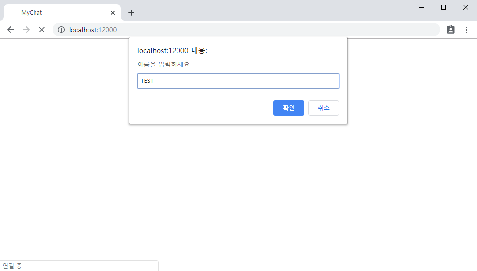

  이미지 실행 시 외부 포트를 12000번으로 지정해주었고, localhost:12000으로 접속할 수 있습니다.

  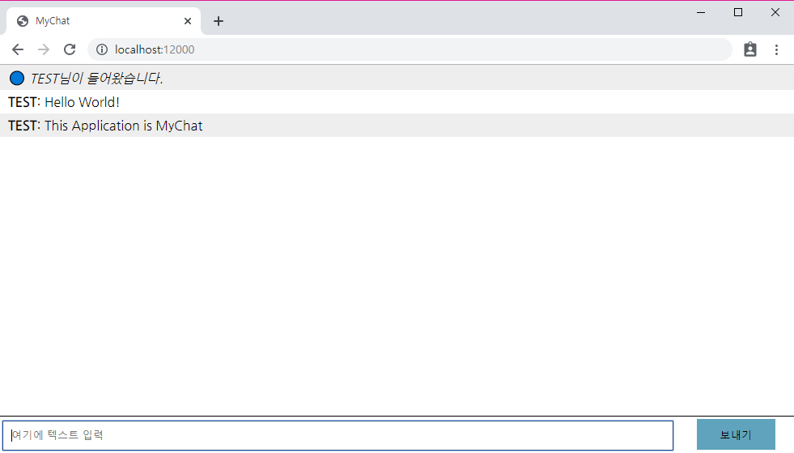

  사용자는 웹에 접속해 메세지를 보낼 수 있습니다.

  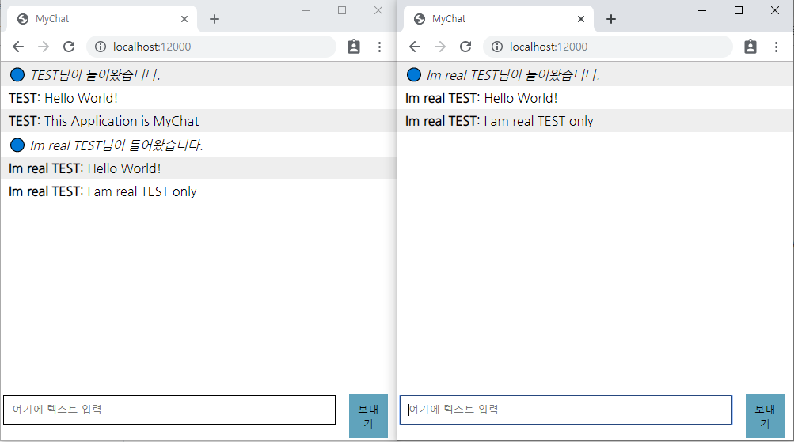

  사용자가 서버에 접속 시 접속 메세지가 뜨고 퇴장 시 퇴장 메세지가 뜨는 것을 볼 수 있습니다.

  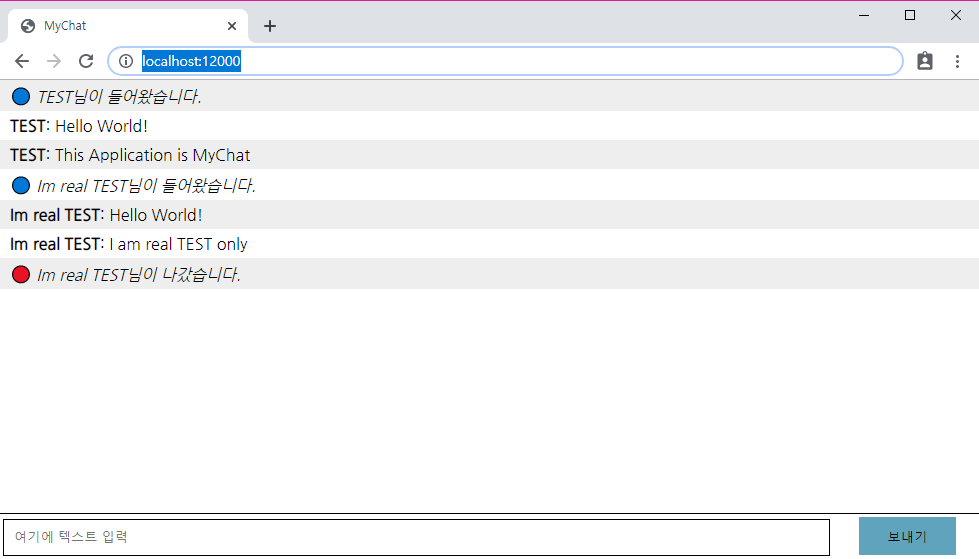

### mydb

- mydb Image Link: [LINK]( https://hub.docker.com/repository/docker/yunjun2/mydb), 1.0.1 version을 기준으로 설명합니다.

- 폴더 구조는 다음과 같습니다.

  ```c
  mydb
  |___sql-scripts
  |	|	CreateTable.sql
  |
  |	Dockerfile
  ```

- 구성 요소의 설명은 다음과 같습니다.

  - sql-scripts/CreateTable.sql

    ```sql
    CREATE TABLE messages (
    username varchar(25),
    message varchar(25),
    chatTime time
    );
    
    ALTER USER root IDENTIFIED WITH mysql_native_password BY 'root';
    ```

    메세지가 저장될 messages 테이블을 생성해주고, Container 외부에서 접속할 때 root 계정이 자동으로 생성되지 않으므로 root 계정의 비밀번호를 설정해 주는 sql 파일입니다. 이는 build시 DB 생성 후 자동으로 실행됩니다.

  - Dockerfile

    ```dockerfile
    # Derived from official mysql image (our base image)
    FROM mysql
    # Add a database
    ENV MYSQL_DATABASE messages
    ENV MYSQL_ROOT_PASSWORD root
    # Add the content of the sql-scripts/ directory to your image
    # All scripts in docker-entrypoint-initdb.d/ are automatically
    # executed during container startup
    COPY ./sql-scripts/ /docker-entrypoint-initdb.d/
    ```

    mysql image를 기반으로 구현되었으며, messages 데이터베이스를 생성해주고 필요한 환경변수 및 파일들을 설정해줍니다. root 계정의 password는 root로 설정되어 있으며 `ENV MYSQL_ROOT_PASSWORD` 명령어를 통해 변경할 수 있습니다.

- 컨테이너에 접속하면 다음과 같은 화면을 볼 수 있습니다.

  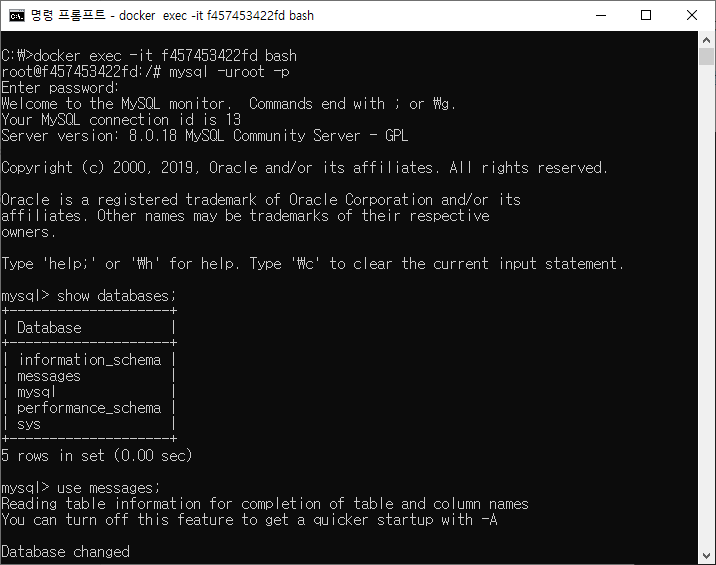

### docker-compose

지금까지 설명한 2개의 이미지를 이용해 manager를 포함한 3대의 docker-machine에 compose 후 2대의 machine사이에서 통신하는 과정을 설명하겠습니다. 

- docker-compose.yml 파일은 다음과 같습니다. 외부 접속 포트를 설정해줄 수 있으며, docker-machine간의 통신을 위해 internal network를 생성해주었습니다.

  ```yaml
  version: '3.7'
  
  services:
    mydb:
      image: yunjun2/mydb:1.0.1
      environment:
        MYSQL_HOST: mydb
      deploy:
        restart_policy:
          condition: on-failure
        replicas: 1
        placement:
          constraints: [node.labels.label == mydb]
      networks:
        mynet:
  
    mychat:
      depends_on:
        - mydb
      image: yunjun2/mychat:1.1.4
      ports:
        - "12000:8080"
      deploy:
        replicas: 1
        restart_policy:
          condition: on-failure
        placement:
          constraints: [node.labels.label == mychat]
      networks:
        mynet:
  
  networks:
    mynet:
      name: mynet
  ```

- docker-compose up

- 메세지 전송이 잘 되는것을 볼 수 있습니다.

  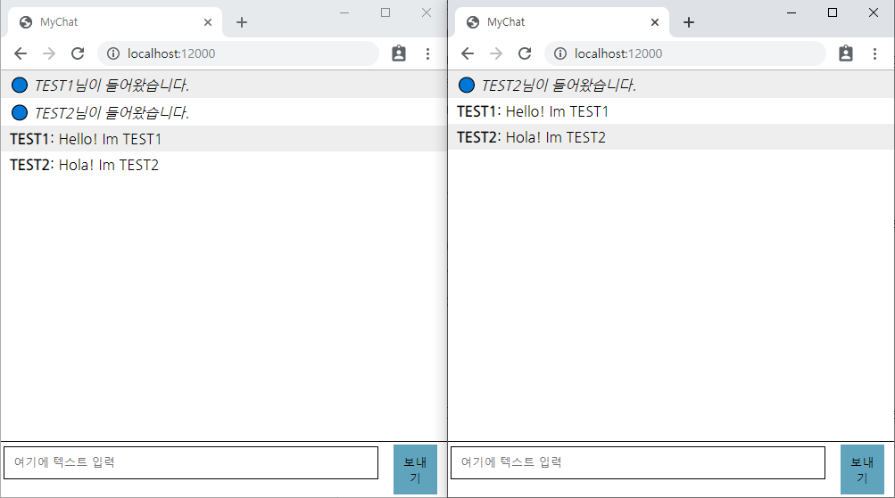

- DB와 table이 잘 생성되고 통신 또한 잘 되는것을 볼 수 있습니다.

  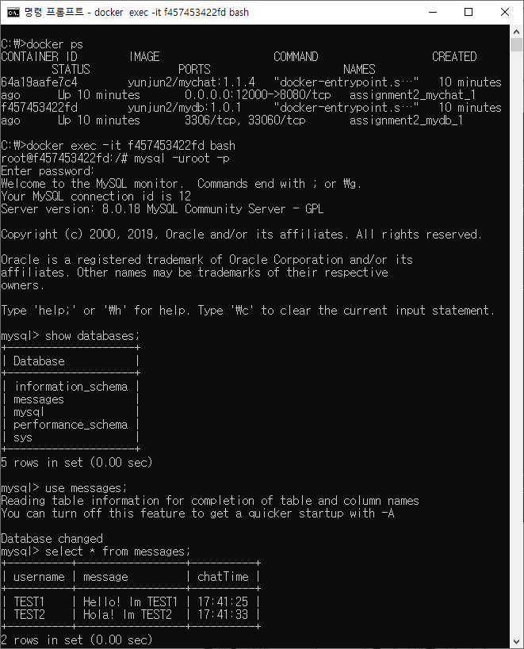

## Kubernetes Migration

앞서 설명한 chatting web application을 Kubernetes로 migration했으며, minikube를 기반으로 진행하였습니다.

- 폴더 구조는 다음과 같습니다.

  ```c
  kubernetes
  |	mychat.yaml
  |	mydb.yaml
  |	autobuild.sh
  |	autodelete.sh
  ```

- 구성 요소 설명은 다음과 같습니다.

  - mychat.yaml

    ```yaml
    apiVersion: v1
    kind: Service
    metadata:
      name: mychat
      labels:
        app: mychat
    spec:
      ports:
      - port: 80
        targetPort: 8080
        protocol: TCP
      type: LoadBalancer
      externalTrafficPolicy: Local
      selector:
        app: mychat
    
    ---
    
    apiVersion: apps/v1
    kind: StatefulSet
    metadata:
      name: mychat
    spec:
      selector:
        matchLabels:
          app: mychat
      serviceName: "mychat"
      replicas: 1
      template:
        metadata:
          labels:
            app: mychat
        spec:
          containers:
          - name: mychat
            image: yunjun2/mychat:1.1.4
            ports:
            - containerPort: 8080
    ```

    1개의 Service와 1개의 StatefulSet을 가지며, LoadBalancer를 통해 cluster 외부에 IP와 Port를 노출시켰습니다. Service에 selector에서 mychat을 가져오는데 이는 StatefulSet의 serviceName을 통해 가져올 수 있습니다.

  - mydb.yaml

    ```yaml
    apiVersion: v1
    kind: Service
    metadata:
      name: mydb
      labels:
        app: mydb
    spec:
      ports:
      - port: 3306
        targetPort: 3306
        protocol: TCP
      selector:
        app: mydb
    
    ---
    
    apiVersion: apps/v1
    kind: StatefulSet
    metadata:
      name: mydb
    spec:
      selector:
        matchLabels:
          app: mydb
      serviceName: "mydb"
      template:
        metadata:
          labels:
            app: mydb
        spec:
          containers:
          - name: mydb
            image: yunjun2/mydb:1.0.1
            ports:
            - containerPort: 3306
    ```

    mychat과 동일한 구성을 가집니다. containerPort를 3306으로 설정해줘야만 mychat pod에서mysql에 접속이 가능합니다.

  - autobuild.sh

    ```shell
    kubectl apply -f mydb.yaml --record
    kubectl apply -f mychat.yaml --record
    
    kubectl patch service mychat \
      -p '{"spec": {"type": "LoadBalancer", "externalIPs":["'$(minikube ip)'"]}}'
    ```

    Kubernetes에서 service와 statefulset을 한번에 deploy하기 위해 작성한 shell script 파일입니다. 특이한 점은 `kubectl path ~` 부분인데, 이는 minikube에서 loadbalancer를 사용할 때의 external-ip 할당 문제 때문입니다. minikube에서는 loadbalancer를 사용해 external-ip를 자동으로 할당해줄 수 없습니다. 그러므로 patch 명령어를 사용해 minikube ip를 가져와 수동으로 할당해주었습니다.

  - autodelete.sh

    ```shell
    kubectl delete service mychat
    kubectl delete statefulset mychat
    kubectl delete service mydb
    kubectl delete statefulset mydb
    ```

    Kubernetes에 deploy한 service와 statefulset을 stop 후 delete하는 명령어들을 한번에 실행시키기 위한 shell script 파일입니다.

- autobuild.sh 파일을 실행시켜 Kubernetes에서 deploy 해보겠습니다.

  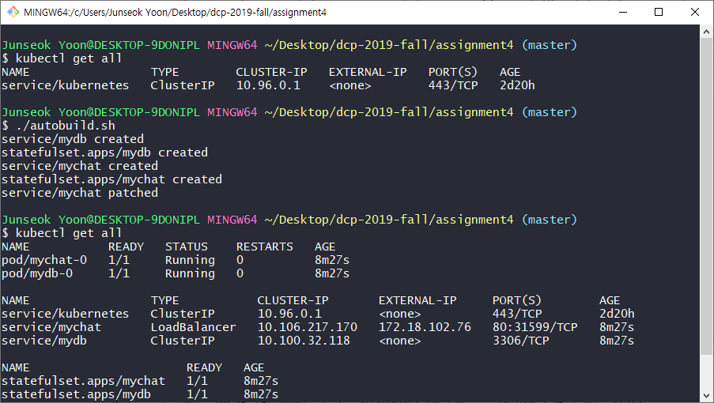

  StatefulSet과 Service가 잘 만들어지고 External-IP까지 잘 할당된 것을 볼 수 있습니다. 이제 external-ip를 통해 application에 접속 후 통신이 잘 되는지 확인해보겠습니다.

  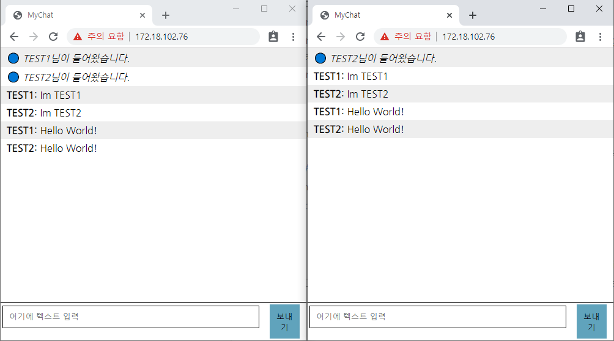

  통신이 잘 되는것을 볼 수 있습니다. 다음은 전송되는 message들이 DB에 잘 저장되는지 확인해보겠습니다. Kubernetes의 pod에 접근할 때에는 docker 명령어와 동일하게 exec 명령어로 접근 가능합니다.

  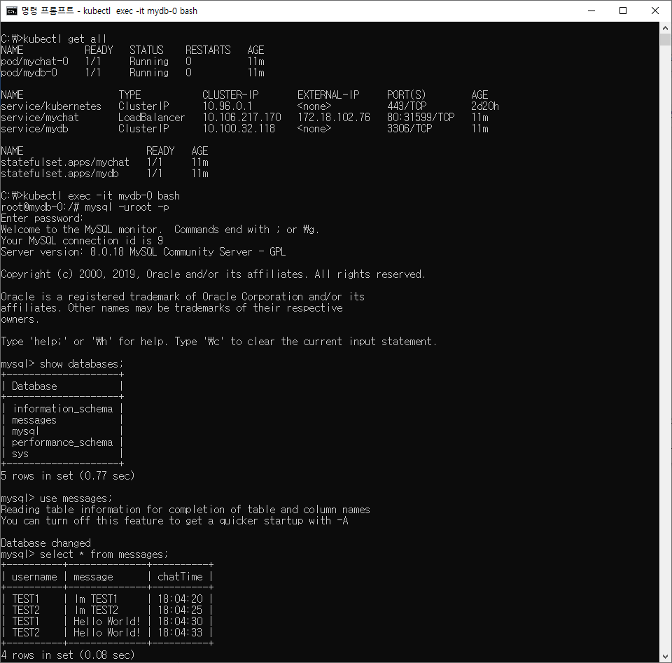

  DB와 연결이 잘 되는것을 볼 수 있습니다. 다음으로 Kubernetes Dashboard를 통해 pod들과 service들을 확인해보겠습니다.

  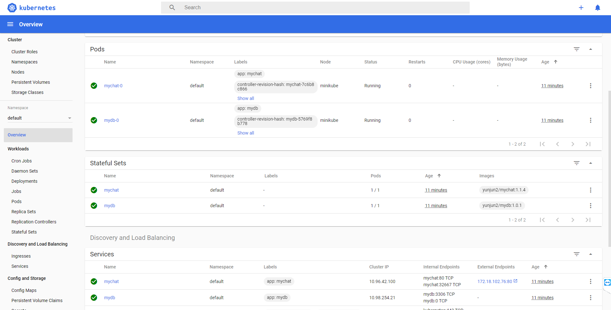

  pod들과 StatefulSet, Service들이 잘 생성되고 실행중인 것을 볼 수 있습니다.

## <번외> Google Kubernetes Engine

Local에서 Minikube로 migration 시 local이 아닌 외부 컴퓨터에서 접속이 되지 않는 현상이 발생했습니다. Ingress로 외부 인터넷에 노출을 해보았지만 역시나 되지 않았습니다. 방화벽이나 인터넷 또는 inbound port의 문제인것 같아 구글링 결과 만족할 만한 답을 얻지 못해 google cloud platform의 gke(google kubernetes engine)에 저의 service를 올려보았고 외부 인터넷에 노출이 목적인 저의 의도를 만족시킬 수 있었습니다.

